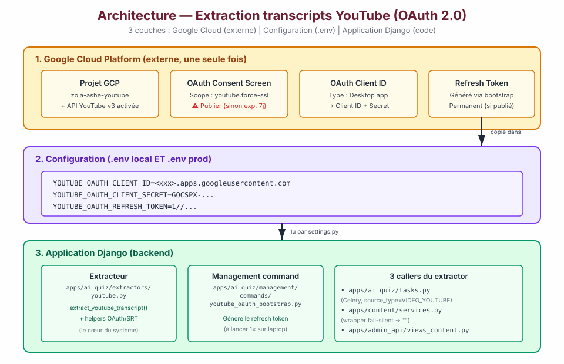
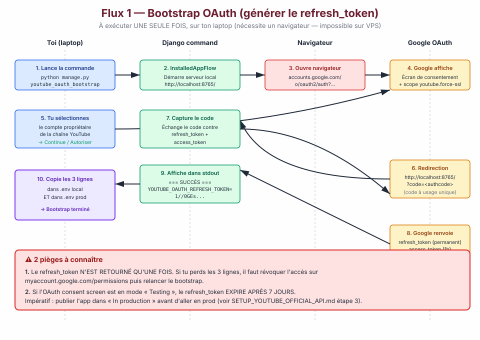
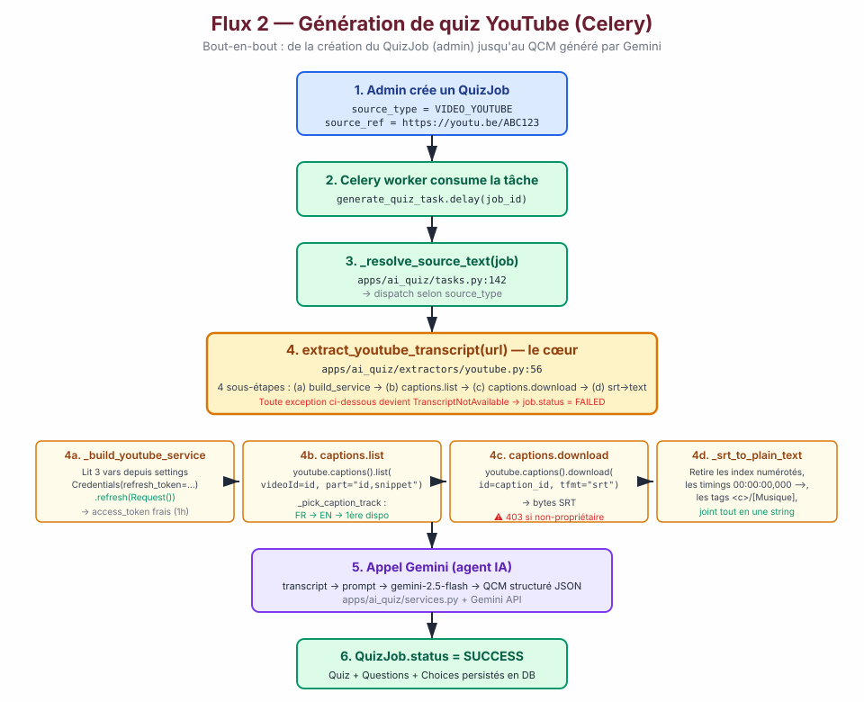
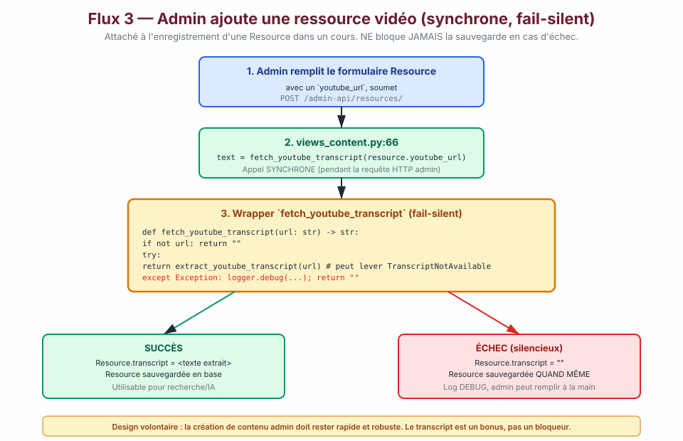
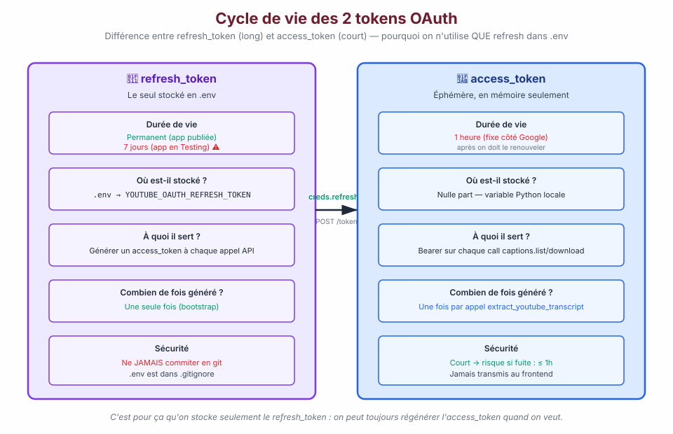
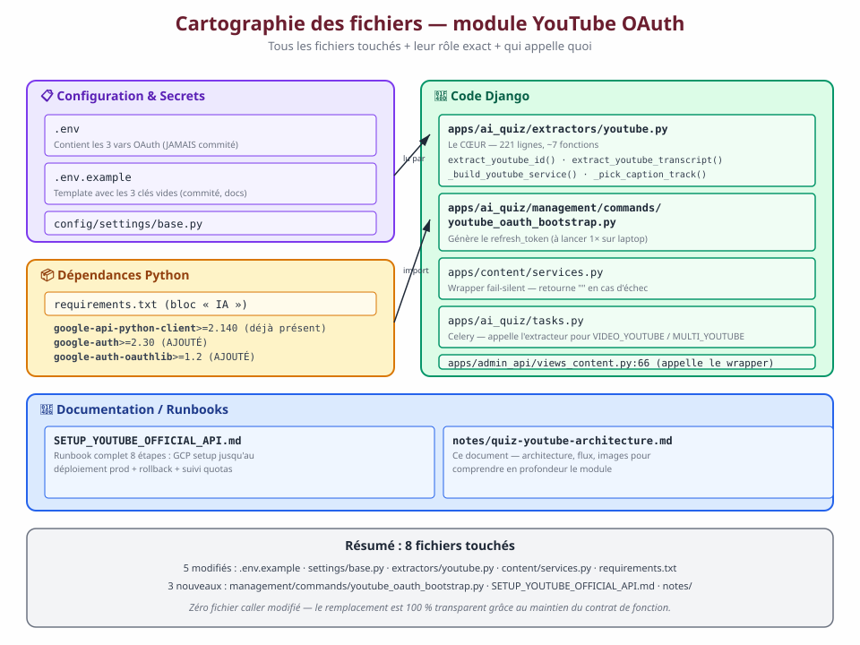

# Quiz YouTube — Architecture & configuration

Note technique de référence pour comprendre l'extraction des transcriptions
YouTube utilisée par le module de génération de QCM (`apps.ai_quiz`).

> **Complément pratique :** ce document explique **comment ça marche**.
> Pour **comment le mettre en place étape par étape**, voir
> [`SETUP_YOUTUBE_OFFICIAL_API.md`](../SETUP_YOUTUBE_OFFICIAL_API.md) à la
> racine du backend (runbook 8 étapes).

---

## TL;DR — Les 3 variables nécessaires

Ces trois variables doivent être renseignées dans `.env` (local **ET**
production) pour que tout fonctionne :

```env
YOUTUBE_OAUTH_CLIENT_ID=<xxxxxxxxxxxx>.apps.googleusercontent.com
YOUTUBE_OAUTH_CLIENT_SECRET=GOCSPX-<xxxxxxxxxxxx>
YOUTUBE_OAUTH_REFRESH_TOKEN=1//<xxxxxxxxxxxxxxxxxxxxxxxxxxxxxxxxxxxxxxxx>
```

| Variable | D'où vient-elle ? | À quoi ça sert ? | Se régénère ? |
|---|---|---|---|
| `YOUTUBE_OAUTH_CLIENT_ID` | Google Cloud Console → **Credentials** → **OAuth Client ID** (type Desktop app) | Identifie l'application ZOLA ASHÉ auprès de Google | Non — stable tant que le Client ID GCP existe |
| `YOUTUBE_OAUTH_CLIENT_SECRET` | Même endroit — affiché en même temps que le Client ID | Secret partagé pour authentifier l'app | Non — peut être rotée dans GCP en cas de fuite |
| `YOUTUBE_OAUTH_REFRESH_TOKEN` | Généré une seule fois par : `python manage.py youtube_oauth_bootstrap --client-id … --client-secret …` | Permet au backend d'obtenir un **access_token** frais à chaque appel API, sans jamais demander la ré-authentification humaine | Rare — sauf si consent screen en mode Testing (expire après 7 jours) ou si l'utilisateur révoque l'accès |

**Où ces variables sont lues :**

- Chargées par `django-environ` dans `config/settings/base.py` (via `env("YOUTUBE_OAUTH_*", default="")`)
- Attachées à `settings.YOUTUBE_OAUTH_CLIENT_ID` / `_SECRET` / `_REFRESH_TOKEN`
- Utilisées uniquement par `apps/ai_quiz/extractors/youtube.py` (fonction `_build_youtube_service`)

Si l'une des 3 est absente ou vide, `extract_youtube_transcript()` lève immédiatement
`TranscriptNotAvailable("OAuth YouTube non configuré …")` sans faire d'appel réseau —
le message est actionnable et pointe vers `SETUP_YOUTUBE_OFFICIAL_API.md`.

---

## Vue d'ensemble

Le système s'organise en 3 couches :



1. **Google Cloud Platform** (externe, config initiale unique) — le projet
   GCP, l'API YouTube v3 activée, l'écran de consentement OAuth, et le
   Client ID de type Desktop app.
2. **Configuration** (`.env` local + prod) — les 3 variables ci-dessus.
3. **Application Django** — l'extracteur, la commande de bootstrap, et les 3
   points d'appel dans le code.

---

## Flux 1 — Bootstrap : générer le refresh_token (une seule fois)

**Où :** ton laptop (pas le VPS — il faut un navigateur graphique).
**Quand :** une seule fois par déploiement (ou après révocation d'accès).



### Pourquoi ce flux ?

Google impose que l'obtention d'un refresh_token passe par un **consentement
humain interactif** (l'utilisateur voit l'écran "cette app veut accéder à
votre chaîne YouTube — autoriser ?"). C'est pour ça qu'on ne peut pas le
générer directement sur le VPS.

La commande `python manage.py youtube_oauth_bootstrap` utilise
`google_auth_oauthlib.flow.InstalledAppFlow.run_local_server(port=8765)` :
elle lance un mini-serveur HTTP local qui capture la redirection OAuth de
Google, ce qui permet de faire l'échange code → tokens sans intervention
manuelle.

### Le résultat

Le refresh_token affiché à l'écran est ce qu'on **stocke définitivement**
dans `.env`. À partir de là, le backend peut appeler l'API YouTube autant
qu'il veut, autant de temps qu'il veut, sans jamais redemander la connexion.

### ⚠ 2 pièges à connaître (documentés dans le diagramme)

1. **Le refresh_token n'est retourné qu'une fois.** Si on le perd, il faut
   révoquer l'accès sur `myaccount.google.com/permissions` puis relancer le
   bootstrap.
2. **En mode "Testing" (par défaut), il expire après 7 jours.** Il faut
   publier l'app OAuth en "In production" dans la console GCP pour avoir un
   token permanent.

---

## Flux 2 — Génération de quiz depuis une vidéo YouTube (Celery)

**Où :** dans un worker Celery de production.
**Quand :** à chaque `QuizJob` créé par l'admin avec `source_type = VIDEO_YOUTUBE`
(ou `MULTI_YOUTUBE` pour un examen final multi-vidéos).



### Résumé des étapes

1. **Admin crée un `QuizJob`** avec l'URL YouTube.
2. **Celery pick up** la tâche via `generate_quiz_task.delay(job_id)`.
3. **`_resolve_source_text(job)`** dispatch selon `source_type` (fichier
   `apps/ai_quiz/tasks.py:132`).
4. **`extract_youtube_transcript(url)`** — le cœur, en 4 sous-étapes :
   - **4a.** `_build_youtube_service` : lit les 3 vars, crée un
     `Credentials(refresh_token=…)`, appelle `.refresh(Request())` pour
     obtenir un access_token frais, construit un client `youtube` via
     `googleapiclient.discovery.build`.
   - **4b.** `captions.list(videoId=…)` : liste toutes les pistes de
     sous-titres disponibles sur la vidéo. `_pick_caption_track` choisit
     la meilleure selon la priorité de langue **FR → EN → première dispo**.
   - **4c.** `captions.download(id=…, tfmt="srt")` : télécharge la piste
     choisie au format SRT.
     - ⚠ **C'est ICI que ça bloque à 403 si l'account OAuth n'est pas
       propriétaire de la vidéo.**
   - **4d.** `_srt_to_plain_text` : parse le SRT (retire les index
     numérotés, timings `00:00:00,000 -->`, tags inline `<c>`, tags
     `[Musique]`) et retourne une string unique.
5. **Appel Gemini** : le transcript est passé à `gemini-2.5-flash` avec un
   prompt de génération de QCM structuré.
6. **QCM persisté** : `Quiz` + `Question` + `Choice` en base, `QuizJob.status = SUCCESS`.

### En cas d'erreur

**Toute exception** dans les étapes 4a-4d devient un
`TranscriptNotAvailable(...)`, catché par Celery, qui marque le job en
`FAILED` avec le message d'erreur dans `job.error_message`. L'admin voit
l'erreur dans le back-office et peut retenter ou changer la source.

---

## Flux 3 — Admin ajoute une ressource YouTube dans un cours (synchrone)

**Où :** endpoint admin `POST /admin-api/resources/` (`apps/admin_api/views_content.py:66`).
**Quand :** à chaque fois qu'un admin crée/édite une `Resource` avec un `youtube_url`.



### Différence clé avec le flux 2 : **fail-silent**

L'appel se fait via le wrapper `fetch_youtube_transcript` dans
`apps/content/services.py` :

```python
def fetch_youtube_transcript(youtube_url: str) -> str:
    if not youtube_url:
        return ""
    try:
        from apps.ai_quiz.extractors.youtube import extract_youtube_transcript
        return extract_youtube_transcript(youtube_url)
    except Exception as exc:
        logger.debug("Transcript fetch failed for %s: %s", youtube_url, exc)
        return ""
```

Si l'extraction échoue (OAuth pas configuré, vidéo tierce, réseau…), la
ressource se sauvegarde **quand même** avec `transcript = ""`. L'admin
peut alors compléter le champ à la main dans l'interface.

**Design volontaire** : la création de contenu doit rester rapide et
robuste. Le transcript est un bonus, jamais un bloqueur.

---

## Cycle de vie des tokens OAuth



Comprendre la différence entre les deux tokens évite les erreurs de config :

- **`refresh_token`** : long-terme, stocké en `.env`, permanent (ou 7 jours
  si consent screen en Testing). C'est la seule chose qu'on garde.
- **`access_token`** : court (1h), généré dynamiquement à chaque appel via
  `creds.refresh(Request())`, **jamais stocké nulle part**. Sert de bearer
  token pour chaque call `captions.list` / `captions.download`.

C'est un pattern OAuth standard : on ne peut pas stocker un access_token
parce qu'il expire trop vite ; on ne veut pas re-consentir manuellement à
chaque appel ; donc on garde le refresh_token qui, lui, peut échanger un
access_token frais à volonté.

---

## Cartographie des fichiers touchés



### Récap des 8 fichiers touchés

**5 modifiés** :

| Fichier | Rôle dans le chantier |
|---|---|
| `.env.example` | Ajout des 3 vars OAuth avec un commentaire pointant vers le runbook |
| `config/settings/base.py` | Lecture des 3 vars via `env("YOUTUBE_OAUTH_*", default="")` |
| `apps/ai_quiz/extractors/youtube.py` | **Réécriture complète** — 221 lignes, ~7 fonctions, cœur du système |
| `apps/content/services.py` | Simplifié — retiré l'ancienne implémentation, wrapper fail-silent qui délègue |
| `requirements.txt` | `youtube-transcript-api` retiré ; `google-auth` + `google-auth-oauthlib` ajoutés |

**3 nouveaux** :

| Fichier | Rôle |
|---|---|
| `apps/ai_quiz/management/commands/youtube_oauth_bootstrap.py` | Commande Django qui lance le flux OAuth interactif et affiche le refresh_token |
| `SETUP_YOUTUBE_OFFICIAL_API.md` | Runbook opérationnel — GCP setup, bootstrap, deploy, rollback |
| `notes/` (ce dossier) | Doc d'architecture avec diagrammes SVG |

**Zéro caller modifié** — c'est le point clé. La signature de
`extract_youtube_transcript(url_or_id, *, language_priority=…)` et le type
d'exception (`TranscriptNotAvailable`) sont inchangés depuis l'ancien
extracteur. Résultat : `apps/ai_quiz/tasks.py`, `apps/content/services.py`
et `apps/admin_api/views_content.py` continuent d'appeler comme avant.

---

## Contraintes dures imposées par Google

Ces contraintes ne peuvent PAS être contournées côté code :

### 1. `captions.download` exige OAuth 2.0 (pas une clé API)

Google refuse ce endpoint pour toute requête authentifiée par simple API
key. Il faut obligatoirement un access_token OAuth avec le scope
`https://www.googleapis.com/auth/youtube.force-ssl`. C'est pourquoi le
chantier a été fait en OAuth et pas en API key.

### 2. `captions.download` exige la propriété de la vidéo

L'account OAuth utilisé pour générer le refresh_token doit être
**propriétaire** de la vidéo (ou explicitement autorisé par le
propriétaire). Sinon → HTTP 403 avec message
`"the caller does not own the requested resource"`.

**Implication pratique :** ce chantier fonctionne uniquement pour les
vidéos de la chaîne YouTube ZOLA ASHÉ. Pour indexer des vidéos externes
(coaches, nutritionnistes tiers), il faut passer par un tout autre
mécanisme (yt-dlp + Whisper — non implémenté).

### 3. Quotas API

- Quota gratuit : **10 000 unités/jour** par projet GCP.
- `captions.list` = 50 unités par appel.
- `captions.download` = 200 unités par appel.
- **→ ~40 vidéos extraites/jour**, largement suffisant pour ZOLA ASHÉ.
- Suivi : [console.cloud.google.com/apis/dashboard](https://console.cloud.google.com/apis/dashboard).

---

## Ce qui reste à faire pour déployer

- [ ] Setup GCP (projet + activation API + OAuth consent screen **publié** + Client ID Desktop)
- [ ] Lancer `python manage.py youtube_oauth_bootstrap` sur laptop
- [ ] Coller les 3 lignes retournées dans `.env` local
- [ ] Coller les 3 lignes retournées dans `.env` prod (VPS)
- [ ] Test bout-en-bout sur une vidéo réelle de la chaîne ZOLA ASHÉ
- [ ] Commit + push + rebuild + `docker compose up --pull=never --force-recreate`

Tout ce qui est côté code est prêt. Il ne reste que des actions humaines
que je ne peux pas exécuter à ta place (setup GCP, laptop avec navigateur).

---

## Cross-references

- Runbook opérationnel : [`../SETUP_YOUTUBE_OFFICIAL_API.md`](../SETUP_YOUTUBE_OFFICIAL_API.md)
- Extracteur : [`../apps/ai_quiz/extractors/youtube.py`](../apps/ai_quiz/extractors/youtube.py)
- Commande bootstrap : [`../apps/ai_quiz/management/commands/youtube_oauth_bootstrap.py`](../apps/ai_quiz/management/commands/youtube_oauth_bootstrap.py)
- Wrapper fail-silent : [`../apps/content/services.py`](../apps/content/services.py) (`fetch_youtube_transcript`)
- Caller Celery : [`../apps/ai_quiz/tasks.py`](../apps/ai_quiz/tasks.py) (`_resolve_source_text`)
- Caller admin sync : [`../apps/admin_api/views_content.py`](../apps/admin_api/views_content.py) (ligne 66)
